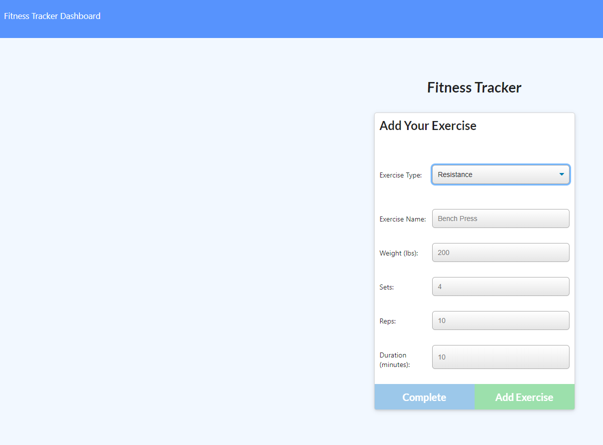
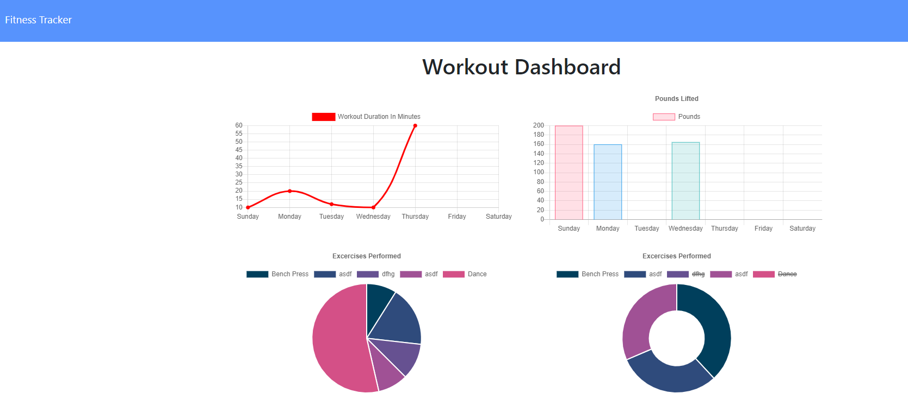

# Fitness Tracker

## Description
This program uses the node.js application to log, update, and view daily workouts.

Here are some of the technologies that were used to the create this program:
JavaScript
node.js
path
json
MongoDB
mongoose
express
morgan

## Table of Contents
  * [Installation](#installation)
  * [Usage](#usage)
  * [Questions](#questions)
  * [License](#license)

## Installation
npm install
node server.js
You can also visit [Heroku](https://sheltered-citadel-65249.herokuapp.com/)

## Usage
This project is used to easily add, update, and keep track of daily workouts.

## Questions
Please feel free to find me on GitHub: [ShaniBlack](https://github.com/ShaniBlack).
You can also [email](shaniblack2004@gmail.com) me with any questions.
## License
This application is covered by the GNU AGPLv3 license.